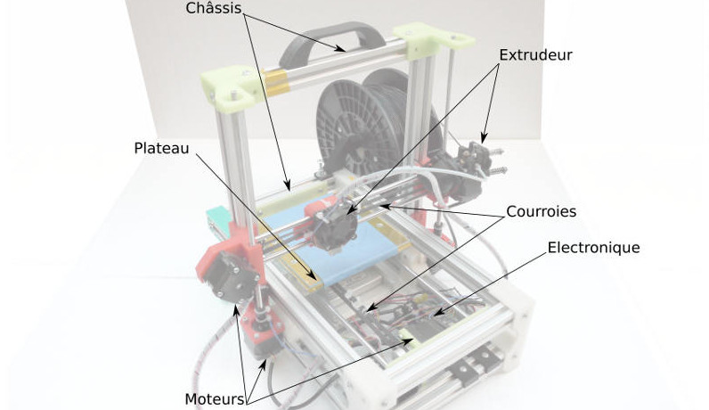
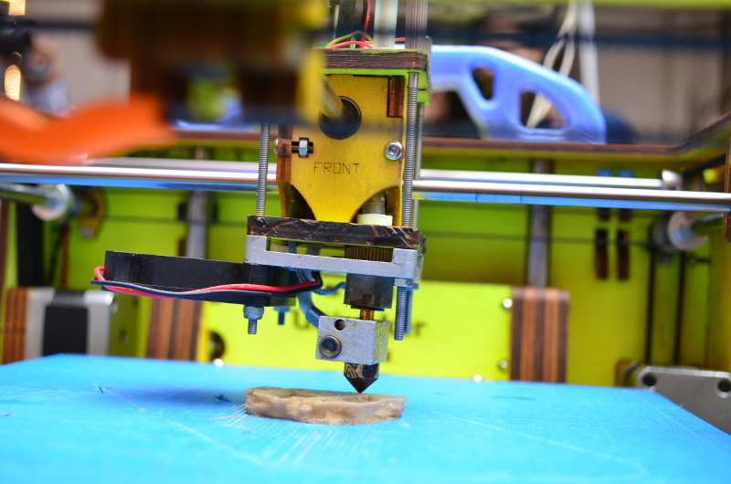

title: Introduction Impression 3D
subtitle: De l'idée à l'objet
author: Sébastien NEDJAR

#Qu'est-ce qu'une imprimante 3D DIY ?
- C'est une machine de prototypage rapide à construire soi-même. 
- Elle permet de fabriquer des objets à partir d'un filament de plastique (PLA ou ABS).
- Bien qu'offrant de grandes possibilités, elle ne permet pas de réaliser des objets trop petits, précis ou fins.
- Elle peut être utilisé à des fins artistiques, architecturales, mécaniques, ...

# Qu'est-ce qu'une imprimante 3D DIY ?

# Différentes parties d'une imprimante 3D DIY
- un châssis fixe qui supporte les 3 axes orthogonaux (X,Y,Z).
- les axes X, Y, Z.
- les courroies des axes.
- les poulies et les moteurs pas-à-pas qui entraînent ces courroies 
  et avec elles, le plateau et la buse de la machine.
- un plateau d'impression équipé d'un lit chauffant.
- un extrudeur.
- une carte électronique.

# Courroies

# Poulies et moteurs

# Plateau chauffant

# Extrudeur

# Qu'est-ce qu'une imprimante 3D DIY ?

# Pourquoi fabriquer sa RepRap ?
- Parce que c'est moins simple que de l'acheter
- Dans un but pédagogique
- Pour connaître et maîtriser son outil
- Par souci d'économie
- Parce que c'est mieux d'utiliser du matériel libre

# Stop le blabla et go la démo !!!
- Pour illustrer le workflow global de l'impression 3D, nous allons voir le processus permettant de passer de la page blanche à l'objet fini 
